# data_visualization_project


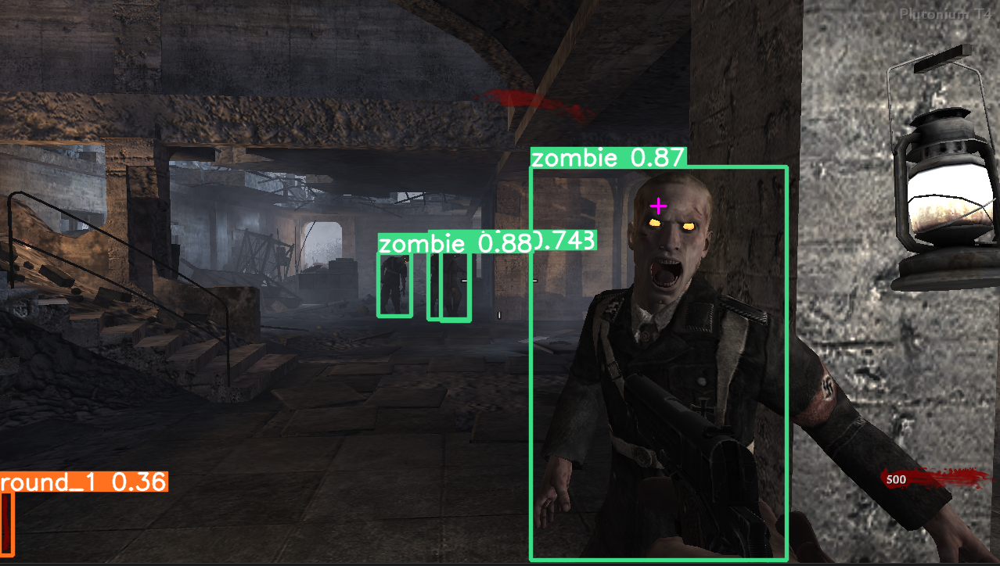

Experimenting with YOLOv8 Object Detection to detect objects in Call of Duty: World at War - Nazi Zombies. The current YOLOv8 model was only trained on Nacht der Untoten with about 843 training images and 94 validation images.

Current model runs at about 20 FPS detecting zombies.

# First time setup

### Create virtual environment

```python
py -3.9 -m venv venv
```

Activate environment

```python
venv/Scripts/activate
```

Upgrade pip

```python
py -m pip install --upgrade pip
```

## Install Nvidia CUDA and PyTorch

Gotchas:

- Assumes you have an NVIDIA GPU on Windows that supports CUDA
- PyTorch requires a specific version of Python to be used for Windows. In this case Python 3.9 will only work (currently 3.11 is the newest) - https://pytorch.org/get-started/locally/#windows-python
- PyTorch only supports a specific version of Nvidia CUDA. The getting-started page for PyTorch says use CUDA 11.8. This is not currently the newest.

Steps:

1. Check PyTorch Get Started page and select your OS, Python, and newest CUDA version.
   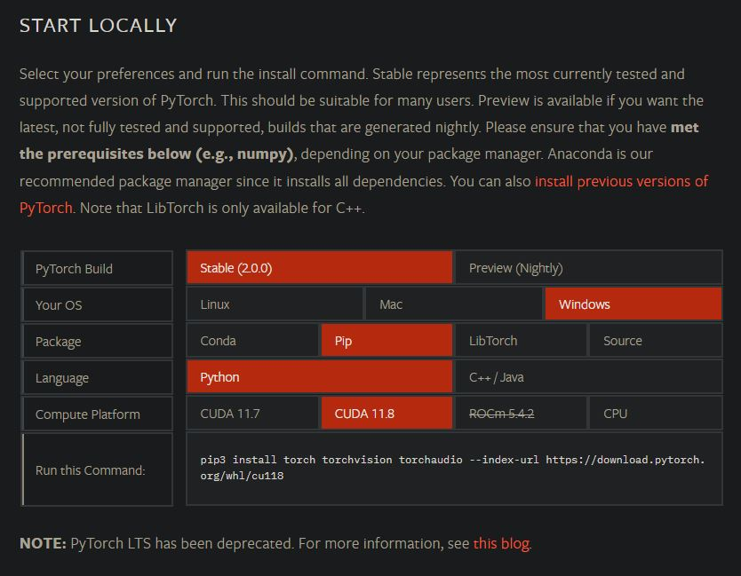
   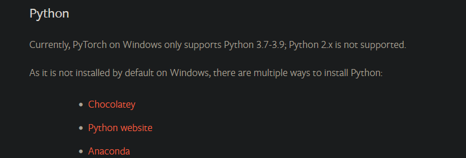

2. Install version of NVIDA CUDA supported by PyTorch
3. Check PyTorch Get Started page for version of CUDA to use
   1. Currently 11.8 - https://developer.nvidia.com/cuda-11-8-0-download-archive?target_os=Windows&target_arch=x86_64&target_version=10&target_type=exe_local
      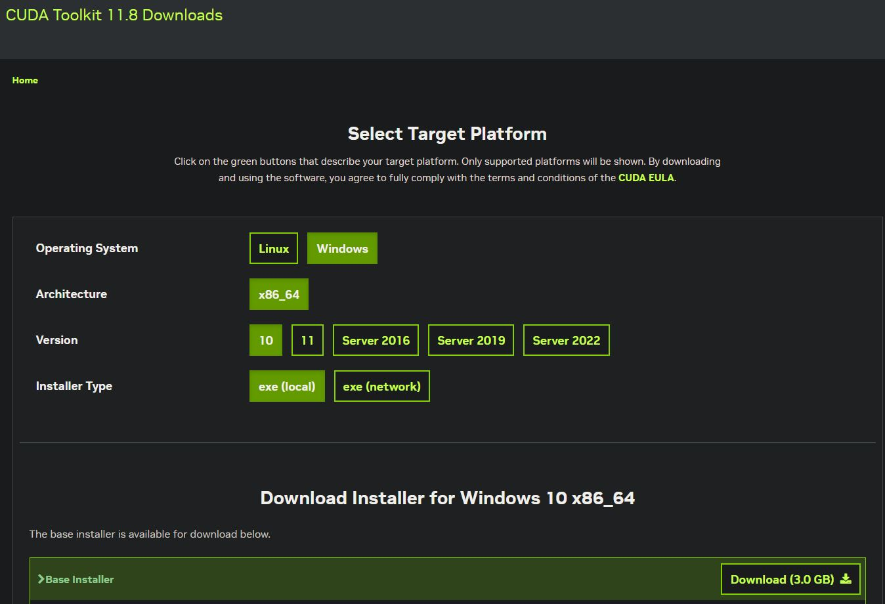

This is a 2.6GB install

Use "--no-cache-dir" to fix some problems when a previous download was being used for install and causing problems.

```python
pip install torch torchvision torchaudio --index-url https://download.pytorch.org/whl/cu118 --no-cache-dir
```

Install requirements

```python
py -m pip install -r requirements.txt
```

Validate PyTorch is working with the GPU

```python
python
>>> import torch
>>> torch.cuda.is_available()
True
```

# Run

Open Plutonium T4 - World at War Nazi Zombies

Script looks for this window name - "Plutonium T4 Singleplayer (r3417)"

Run script

```python
python .\zombies_object_detection.py
```

# Detection:

The YOLOv8 model was trained on Plutonium T4 Call of duty: World at War Nazi Zombies. All training was done on Nacht der Untoten standing in the initial spawn position and looking around. This was done because this was an initial test to detect the AI and have another AI play the game by looking around and shooting. The plan was to later go back after learning what could be improved and redo this model from scratch. The model did better than expected when moving around in other locations in detecting zombies.

One of the issues was in labeling round numbers. The round 1 label sometimes picks up on other round since the tally marks are the same. Tried some logic where the next round had to be +1 and wouldn't switch until 10 seconds had passed. That seemed better but need another way to detect rounds. Another issue was the hit detection. It was trained so that a full red screen means hit. But in practice it detects hundreds of hits. Logic was put in to only detect as one hit if many were detected within 1 second. Also not sure how to extend data like this. If new data needed to be detected by the model, could the class just be trained on the small subset of data, or would all data have to be relabeled? I am thinking all relabeled.

843 training images and 94 validation images

### Steps:

1. Get brightness level in game so if changes in the future we can go back

   1. r_gamma command in Plutonium

   2. Gamma cannot be changed when not in full screen so just trained on the default brightness

2. Figure out recording of game

   1. Download and install OBS screen recorder - https://obsproject.com/download
   2. OBS -> Window Recording > Expand to screen size > settings > 60 fps, indistinguishable quality > output dir, start recording

3. Split recording into frames

   a. ffmpeg - https://www.gyan.dev/ffmpeg/builds/ full download, put into program files, added to Windows Path User Environment Variable

   `ffmpeg.exe -i .\zombies_recording.mkv -vf fps=1 -qscale:v 1 zombies_third*%d.jpg`

   1. vf fps=1 to make sure 1 frame of the video per second goes to an image
   2. %d to increase the file name number each time
   3. -qscale:v 1 to set the jpeg scale to highest which is 1. Goes from 1-32 2 is default

4. Figure out labeler to use

   1. label-studio # newer version of labelmg
      1. python -m venv venv/
      2. venv/Scripts/activate
      3. py -m pip install --upgrade pip
      4. pip install label-studio
      5. label-studio start
      6. 127.0.0.1:8080

5. Label zombies, round, hit, and game over
6. Train on yolov8
   1. Had an issue where yolo8 would point to yolov5. Didn't realize there were appdata settings for ultalytics
   2. PC Crashed when installing yolov8. Fix was to add --no-cache-dir to the install
   3. pip install torch torchvision torchaudio --index-url https://download.pytorch.org/whl/cu118 --no-cache-dir
   4. pip install ultralytics
   5. Copy images to folder
   6. yolo task=detect mode=train model=yolov8n.pt imgsz=1280 data=zombies_1.yaml epochs=100 batch=4 name=zombies_1_8n
7. Figure out running yolov8 pre trained model on screen recording
   1. Used Win32 API to take screenshots of the game, and send to YOLOv8 to process
8. Figure out basic controls
   1. Initial testing was done with pyautogui to control the screen. Ran into issues with the new place to move the mouse to. Not sure if there were scaling issues, or if it has to do with the mouse always being in the middle. It seemed that turning 90, 180, 360 degrees was somewhat deterministic. When actually aiming and shooting there were issues.
   2. Was able to determine where to shoot by looking for the largest zombie bounding box and putting a crosshair at the top middle.
9. Look into how the data from the model could be parsed to then send to pyauto gui, or NEAT.

### classes:

1. game_over
2. hit
3. round_1
4. round_2
5. round_3
6. round_4
7. round_5
8. zombie

# Detection Examples:


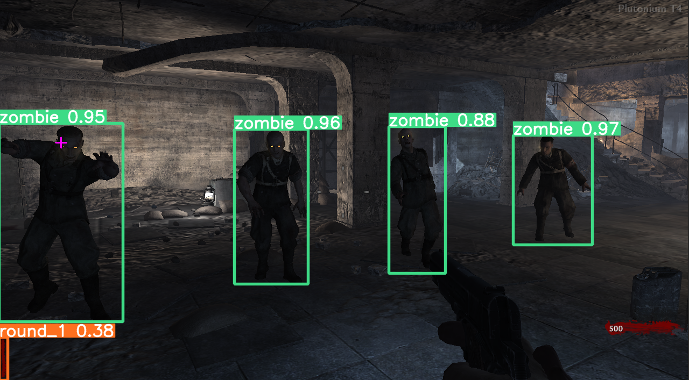
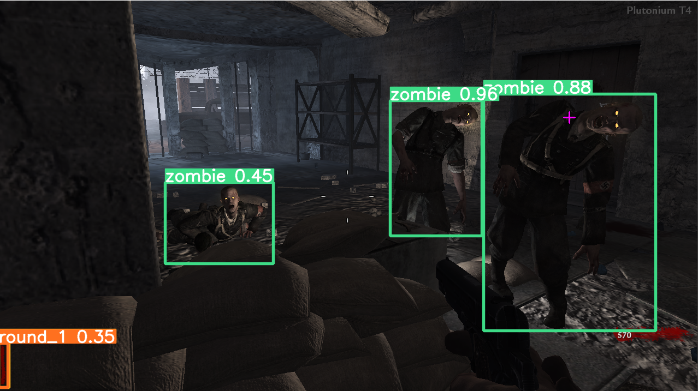
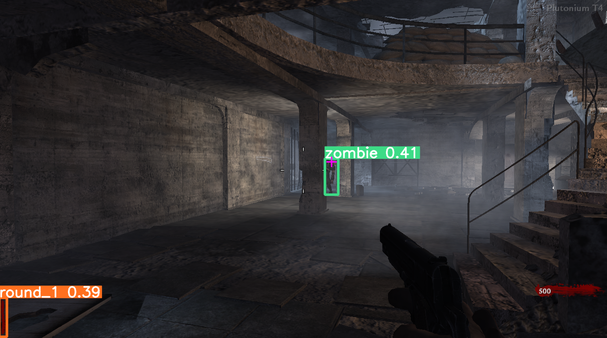
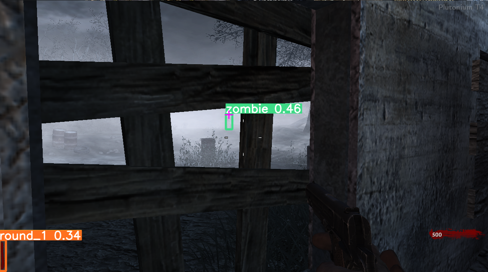
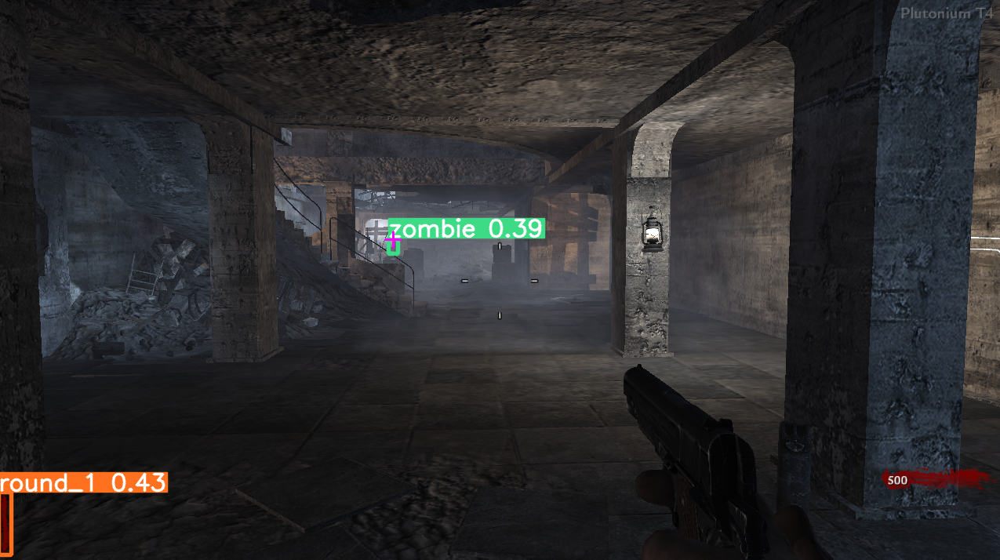
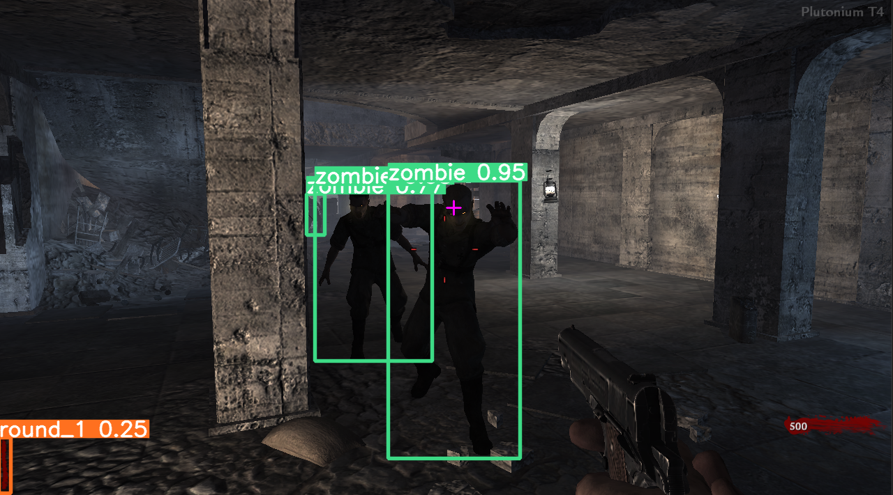
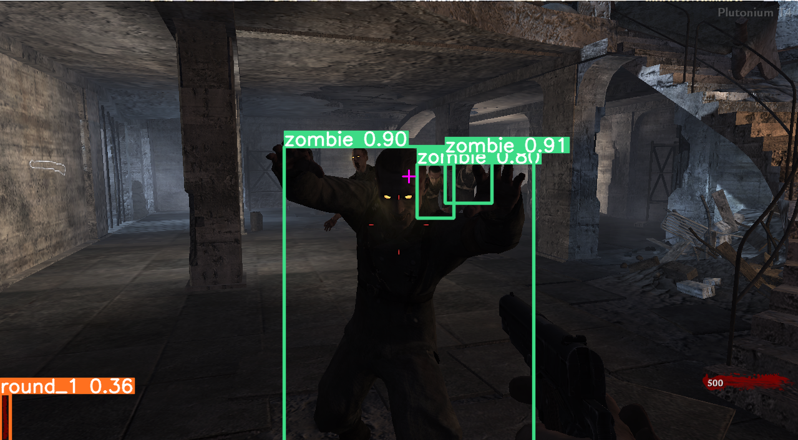

https://user-images.githubusercontent.com/50935601/236658579-99b3c91c-0461-47fa-bb56-cb9d9e6fa3cf.mp4
